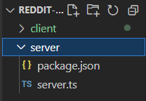

https://nextjs.org/docs/api-reference/create-next-app

- ` npx create-next-app@latest --typescript ./` : This CLI tool enables you to quickly start building a new Next.js application, with everything set up for you.

- 서버
  - `npm init`: package.json 파일 생성
    - 프로젝트 정보와 의존성 관리 문서
    - 패키지 설치 시 정보 기록됨

- ```json
  package name: (server)
  version: (1.0.0)
  description:
  entry point: (index.js) server.js
  test command:
  git repository:
  keywords:
  author:
  license: (ISC)
  ```

  - npm init 시 `package.js` 에 입력한 내용대로 생성됨

  - `server.js` -> `server.ts`로 바꿔줘야 함: 타입스크립트를 사용할 것이기 때문

  - ### 변경내용

  - ```json
    {
      "name": "server",
      "version": "1.0.0",
      "description": "",
      "main": "server.ts",
      "scripts": {
        "test": "echo \"Error: no test specified\" && exit 1"
      },
      "author": "",
      "license": "ISC"
    }
    
    ```

  - 

  - nodemon: 서버 코드를 변경할 때마다 서버를 재시작하여 일을 자동으로 대신 해줌
  - ts-node: node.js 상에서 typescript compiler를 통하지 않고도, 직접 typescript 를 실행시키는 역할을 함
  - morgan: node.js에서 사용되는 로그 관리를 위한 미들웨어
  - @types/express , @types/node : Express및 node.js에 대한 type 정의에 도움이 됨
    - morgan 모듈 안에 있는 타입 정의에 도움이 된다..

  

  - `npm install typescript ts-node @types/node @types/express @types/morgan --save-dev`
    - 개발환경에 필요한 모듈들
  - `npm install morgan nodemon express --save`
    -  프로덕션 모드에 필요한 모듈들
  - `npx tsc --init`
    - typescript 로 짜여진 코드를 자바스크립트로 컴파일하는 옵션을 설정하는 파일
    - 타입스크립트 컴파일은 tsc라는 명령어 사용
    - 아래 커맨드로 tsconfig.json 파일 생성

- ## async & await

  - `async`와 `await`라는 특별한 문법을 사용하면 프라미스를 좀 더 편하게 사용 할 수 있음

    1. ### async

       - `async` 키워드부터 알아봅시다. `async`는 function 앞에 위치

       - ```js
         async function f() {
           return 1;
         }
         ```

       -  해당 함수는 항상 프라미스를 반환

         - 프라미스 객체는 **executor('제작 코드' 혹은 '가수')와 결과나 에러를 받을 소비 함수('팬')를 이어주는 역할**
         - 

